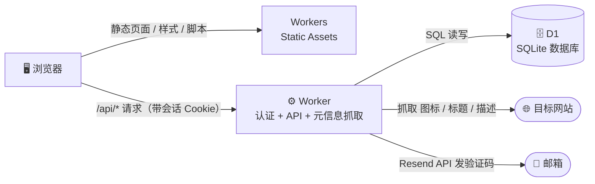

<div align="center">

# 🔖 云书签 · Cloud Bookmark

**一个跑在 Cloudflare 免费服务上的多用户个人书签站**

邮箱验证码注册登录 · 自动抓取网站图标与描述 · 首个用户自动成为管理员 · 一键部署

[](https://deploy.workers.cloudflare.com/?url=https://github.com/junwindxqw/cloudflare_web_bookmark)
[](https://workers.cloudflare.com/)
[-F38020?logo=cloudflare&logoColor=white)](https://developers.cloudflare.com/d1/)
[](#-技术栈与服务)
[](LICENSE)

</div>

---

## ✨ 功能特性

|  | 功能 | 说明 |
| --- | --- | --- |
| 👥 | **多用户体系** | 邮箱 + 4 位验证码注册，邮箱 + 密码登录；**首个注册的用户自动成为管理员**，可管理（删除）其他用户 |
| 📧 | **邮箱验证码** | 注册与找回密码均通过邮箱验证码完成；验证码 10 分钟有效、错 5 次作废、60 秒重发冷却、同 IP 限频 |
| 🔑 | **找回密码** | 忘记密码时通过邮箱验证码重置，重置后所有已登录设备强制下线 |
| 🧠 | **智能收录** | 只需输入网址，服务端自动抓取网站**图标（Favicon）**与**标题、描述**（解析 `<title>` / Open Graph / meta 标签），也可手动修改 |
| 🖱️ | **点击即达** | 点击书签**图标**或标题，自动在浏览器**新标签页**中打开目标网站 |
| 🗂️ | **单页管理** | 一个页面完成全部操作：添加 / 编辑 / 删除（二次确认），并提供关键词搜索过滤；每个用户的数据完全隔离 |
| 🌗 | **深浅色主题** | 自动跟随系统外观切换深色 / 浅色模式 |
| 📱 | **响应式布局** | 桌面、平板、手机浏览器均能良好显示 |
| 🛡️ | **安全设计** | 抓取仅允许公网 `http/https`（防 SSRF）；PBKDF2 密码哈希；登录连续失败锁定；会话 HttpOnly Cookie |
| 🪶 | **零构建依赖** | 前端为原生 HTML / CSS / JS，无框架、无打包步骤，克隆即用 |

## 🧱 技术栈与服务（全部免费）



| 组件 | 使用的 Cloudflare / 第三方服务 | 免费额度（个人使用绰绰有余） |
| --- | --- | --- |
| 页面托管 | **Workers 静态资源（Static Assets）** | 静态资源请求不计费 |
| API 服务 | **Workers** | 10 万次请求 / 天 |
| 数据存储 | **D1（SQLite）** | 500 万行读取 / 天，10 万行写入 / 天 |
| 邮件发送 | **Resend**（第三方免费层） | 100 封 / 天，3000 封 / 月 |

> 💡 除邮件发送使用 Resend 免费层外，其余全部运行在 Cloudflare 免费计划内，**0 成本**。

## 🚀 一键部署

1. 将本仓库 Fork 或推送到你自己的 GitHub 账号下；
2. 点击下方按钮（若按钮中的仓库地址不是你的，请把 `YOUR_REPO_URL` 替换后从浏览器打开）：

   > [](https://deploy.workers.cloudflare.com/?url=https://github.com/junwindxqw/cloudflare_web_bookmark)
   >
   > `https://deploy.workers.cloudflare.com/?url=YOUR_REPO_URL`

3. 按页面提示登录 Cloudflare 并确认部署，Cloudflare 会**自动创建 Worker 与 D1 数据库**并完成绑定；
4. 数据库表结构会在**首次访问时自动初始化**，无需手动执行 SQL；
5. 配置邮件服务（见下一节），然后打开站点——**第一个注册的账号即管理员**。

## 📧 邮件服务配置（必做一步）

Workers 无法直连 SMTP 发信，项目使用对 Workers 最友好的 [Resend](https://resend.com/) 发送验证码：

1. 注册 [Resend](https://resend.com/)（免费层每天 100 封，足够个人使用）；
2. 创建 API Key，并在 Cloudflare 中配置为 Worker 的**密钥（Secret）**：

   ```bash
   npx wrangler secret put RESEND_API_KEY
   # 按提示粘贴你的 API Key
   ```

3. 配置发件人（环境变量 `MAIL_FROM`，如 `云书签 <noreply@example.com>`）：
   - **正式使用**：在 Resend 控制台验证你自己的域名（添加 DNS 记录），发件人使用该域名下的地址；同时建议把自定义域名绑定到 Worker；
   - **快速试用**：不配置 `MAIL_FROM` 时默认使用 `onboarding@resend.dev`，此时**验证码只会发到 Resend 账号本人的邮箱**，仅适合体验流程。

| 环境变量 | 必填 | 说明 |
| --- | --- | --- |
| `RESEND_API_KEY` | 发信必填 | Resend API 密钥（用 `wrangler secret put` 配置为密钥） |
| `MAIL_FROM` | 建议配置 | 发件人，如 `"云书签 <noreply@example.com>"` |
| `MAIL_DEV_MODE` | 否 | 设为 `true` 时**不真实发信**，验证码直接随 API 返回。⚠️ 仅限本地调试，生产环境切勿开启 |
| `PBKDF2_ITERATIONS` | 否 | 密码哈希迭代次数，默认 `10000`（免费版 CPU 限制下的保守值，付费版可调高） |

> 💡 **本地开发**无需配置任何邮件变量：项目根目录的 `.dev.vars` 中设 `MAIL_DEV_MODE=true`，验证码会直接显示在页面上。

## 🛠️ 手动部署（CLI 方式）

```bash
# 1. 安装依赖（只有 wrangler 一个开发依赖）
npm install

# 2. 登录 Cloudflare
npx wrangler login

# 3. 首次部署（后续更新代码后同样执行这条命令）
npm run setup
```

首次执行部署时，wrangler 会检测到配置里的 D1 绑定还没有 `database_id`，自动提示**创建新的 D1 数据库**，并把生成的 id 回写进 `wrangler.jsonc`，之后再次部署无需任何人工步骤。书签与用户表结构则在**首次访问时自动初始化**。

<details>
<summary>非交互环境（CI 等）的分步部署（了解即可）</summary>

```bash
npx wrangler d1 create cloud-bookmark-db
# 复制输出中的 database_id，粘贴到 wrangler.jsonc 的 d1_databases[0] 下：
# "database_id": "<粘贴到这里>"
npx wrangler deploy
```

</details>

## 💻 本地开发

```bash
npm install
npm run dev        # 启动 wrangler dev，访问 http://localhost:8787
```

- 本地运行时 D1 由 wrangler 自动模拟（存放在 `.wrangler/` 目录），无需任何配置；
- `.dev.vars` 已默认开启 `MAIL_DEV_MODE=true`，注册/找回密码时验证码直接显示在页面提示中；
- 从 v1（单用户版）升级：老库会自动补 `user_id` 列，**首个注册的账号（管理员）会自动认领历史书签**。

## 📡 API 一览

| 方法 | 路径 | 鉴权 | 说明 |
| --- | --- | --- | --- |
| `POST` | `/api/auth/register/start` | 公开 | 发送注册验证码（4 位，10 分钟有效） |
| `POST` | `/api/auth/register/finish` | 公开 | 校验验证码并完成注册，返回会话 Cookie |
| `POST` | `/api/auth/login` | 公开 | 邮箱 + 密码登录 |
| `POST` | `/api/auth/logout` | 登录 | 退出登录 |
| `GET` | `/api/auth/me` | 公开 | 当前登录用户（未登录返回 `null`） |
| `POST` | `/api/auth/reset/start` | 公开 | 发送找回密码验证码 |
| `POST` | `/api/auth/reset/finish` | 公开 | 校验验证码并重置密码 |
| `GET` | `/api/bookmarks` | 登录 | 当前用户的书签列表（倒序） |
| `POST` | `/api/bookmarks` | 登录 | 新增书签，缺省字段自动抓取补全 |
| `PUT` | `/api/bookmarks/:id` | 登录 | 更新本人书签（管理员可操作任意书签） |
| `DELETE` | `/api/bookmarks/:id` | 登录 | 删除本人书签（管理员可操作任意书签） |
| `POST` | `/api/metadata` | 登录 | 抓取指定网址的图标 / 标题 / 描述 |
| `GET` | `/api/admin/users` | 管理员 | 用户列表（含书签数） |
| `DELETE` | `/api/admin/users/:id` | 管理员 | 删除用户及其全部书签与会话 |

```bash
# 示例：登录并保持会话
curl -c cookies.txt -X POST https://<你的域名>/api/auth/login \
  -H "content-type: application/json" \
  -d '{"email": "you@example.com", "password": "your-password"}'

# 示例：带会话添加书签（自动补全图标/描述）
curl -b cookies.txt -X POST https://<你的域名>/api/bookmarks \
  -H "content-type: application/json" \
  -d '{"url": "https://github.com"}'
```

## 🗂️ 项目结构

```
cloudflare_web_bookmark/
├── public/                 # 静态资源（由 Workers 静态资源托管）
│   ├── index.html          # 单页（认证页 + 书签应用）
│   ├── style.css           # 样式（含深浅色主题、响应式）
│   ├── app.js              # 前端逻辑（无框架）
│   └── favicon.svg         # 站点图标
├── src/
│   ├── index.js            # Worker 入口：建表迁移 + 路由鉴权 + 书签 CRUD
│   ├── auth.js             # 注册/登录/找回密码/会话/登录锁定/管理员接口
│   ├── metadata.js         # 网站元信息抓取（防 SSRF、编码识别、图标解析）
│   ├── mail.js             # Resend 验证码邮件（含本地调试模式）
│   └── util.js             # 响应包装 / Cookie / 哈希 / 随机数
├── schema.sql              # D1 表结构（供参考，运行时也会自动建表/迁移）
├── wrangler.jsonc          # Cloudflare Workers 配置
└── package.json
```

## 🔐 安全设计

- **密码存储**：PBKDF2-SHA256（默认 1 万次迭代 + 每用户随机盐）。免费版 Worker 有 10ms CPU 限制，故迭代次数取保守值；付费版可通过 `PBKDF2_ITERATIONS` 调高。
- **会话**：随机 256 位令牌，数据库仅存 SHA-256 哈希；HttpOnly + SameSite=Lax Cookie，有效期 30 天；重置密码后强制全部下线。
- **验证码**：4 位数字、10 分钟有效、错 5 次作废、同邮箱 60 秒重发冷却、同 IP 每小时最多 10 封。
- **登录保护**：同一邮箱连续失败 5 次锁定 15 分钟（重置密码成功即解锁）。
- **防 SSRF**：抓取元信息仅允许公网 `http/https` 地址，拒绝本地回环、内网与保留 IP 段，重定向逐跳复检；该功能仅登录用户可用。
- **数据隔离**：书签按用户隔离，普通用户无法读写他人数据；管理员可删除用户（级联删除其书签与会话），但不能删除自己。

## ❓ 常见问题

- **谁可以注册？** 部署后开放注册（邮箱验证码）。若希望关闭注册，可后续加环境变量开关。
- **为什么用 Workers 而不是 Pages？** Workers 静态资源已经可以同时托管前端页面与 API，一个项目一次部署即可，这也是 Cloudflare 官方目前推荐的形态。
- **为什么用 D1 而不是 KV？** 书签、用户、会话都是典型的结构化数据，D1（SQLite）比键值型的 KV 更合适；免费额度也更高。
- **为什么不把图标存到 R2？** 直接引用目标站点图标即可正常显示，省去存储与同步；个别站点开启防盗链时，前端会自动降级为「域名首字母 + 随机配色」的字母头像兜底。
- **从 v1 单用户版升级？** 无需手动操作：老库自动补列，首个注册账号成为管理员并自动认领历史书签。

## 📄 License

[MIT](LICENSE)
