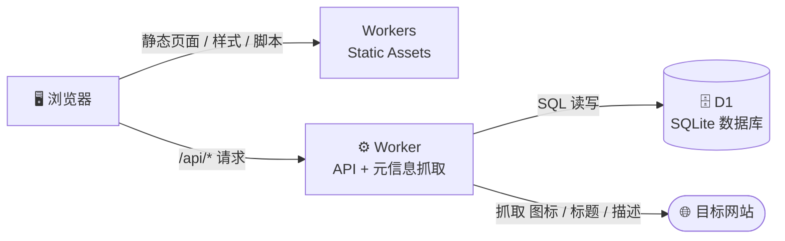

<div align="center">

# 🔖 云书签 · Cloud Bookmark

**一个跑在 Cloudflare 免费服务上的极简个人书签站**

输入网址，自动抓取网站图标与描述 · 单页管理 · 点击即达 · 无需登录 · 一键部署

[](https://deploy.workers.cloudflare.com/?url=https://github.com/junwindxqw/cloudflare_web_bookmark)
[](https://workers.cloudflare.com/)
[-F38020?logo=cloudflare&logoColor=white)](https://developers.cloudflare.com/d1/)
[](#-技术栈与服务)
[](LICENSE)

</div>

---

## ✨ 功能特性

|  | 功能 | 说明 |
| --- | --- | --- |
| 🧠 | **智能收录** | 只需输入网址，服务端自动抓取网站**图标（Favicon）**与**标题、描述**（解析 `<title>` / Open Graph / meta 标签），也可以手动修改 |
| 🖱️ | **点击即达** | 点击书签**图标**或标题，自动在浏览器**新标签页**中打开目标网站 |
| 🗂️ | **单页管理** | 一个页面完成全部操作：添加 / 编辑 / 删除（二次确认），并提供关键词搜索过滤 |
| 🌗 | **深浅色主题** | 自动跟随系统外观切换深色 / 浅色模式 |
| 📱 | **响应式布局** | 桌面、平板、手机浏览器均能良好显示 |
| 🛡️ | **防 SSRF 抓取** | 服务端抓取网页元信息时仅允许公网 `http/https` 地址，拒绝本地回环、内网与保留 IP 段 |
| 🪶 | **零构建依赖** | 前端为原生 HTML / CSS / JS，无框架、无打包步骤，克隆即用 |

## 🧱 技术栈与服务（全部免费）



| 组件 | 使用的 Cloudflare 服务 | 免费额度（个人使用绰绰有余） |
| --- | --- | --- |
| 页面托管 | **Workers 静态资源（Static Assets）** | 静态资源请求不计费 |
| API 服务 | **Workers** | 10 万次请求 / 天 |
| 数据存储 | **D1（SQLite）** | 500 万行读取 / 天，10 万行写入 / 天 |

> 💡 整个项目运行在 Cloudflare 免费计划内，**0 成本**；书签数据存放在 D1 中，无需自建服务器。

## 🚀 一键部署

1. 将本仓库 Fork 或推送到你自己的 GitHub 账号下；
2. 点击下方按钮（若按钮中的仓库地址不是你的，请把 `YOUR_REPO_URL` 替换为你自己的仓库地址后从浏览器打开）：

   > [](https://deploy.workers.cloudflare.com/?url=https://github.com/junwindxqw/cloudflare_web_bookmark)
   >
   > `https://deploy.workers.cloudflare.com/?url=YOUR_REPO_URL`

3. 按页面提示登录 Cloudflare 并确认部署，Cloudflare 会**自动创建 Worker 与 D1 数据库**并完成绑定；
4. 数据库表结构会在**首次访问时自动初始化**，无需手动执行 SQL；
5. 部署完成后，打开 `https://<项目名>.<你的子域>.workers.dev` 即可开始使用。

## 🛠️ 手动部署（CLI 方式）

如果你更喜欢命令行，也可以用 wrangler 手动部署：

```bash
# 1. 安装依赖（只有 wrangler 一个开发依赖）
npm install

# 2. 登录 Cloudflare
npx wrangler login

# 3. 首次部署（后续更新代码后同样执行这条命令）
npm run setup
```

首次执行部署时，wrangler 会检测到配置里的 D1 绑定还没有 `database_id`，自动提示**创建新的 D1 数据库**，并把生成的 id 回写进 `wrangler.jsonc`，之后再次部署无需任何人工步骤。书签表结构则在**首次访问时自动初始化**，无需手动执行 SQL。

<details>
<summary>非交互环境（CI 等）的分步部署（了解即可）</summary>

```bash
npx wrangler d1 create cloud-bookmark-db
# 复制输出中的 database_id，粘贴到 wrangler.jsonc 的 d1_databases[0] 下：
# "database_id": "<粘贴到这里>"
npx wrangler deploy
```

</details>

## 💻 本地开发

```bash
npm install
npm run dev        # 启动 wrangler dev，访问 http://localhost:8787
```

- 本地运行时 D1 由 wrangler 自动模拟（存放在 `.wrangler/` 目录），无需任何配置；
- 表结构同样是首次访问时自动创建。

## 📡 API 一览

| 方法 | 路径 | 说明 |
| --- | --- | --- |
| `GET` | `/api/bookmarks` | 获取全部书签（按创建时间倒序） |
| `POST` | `/api/bookmarks` | 新增书签，`title` / `description` / `icon_url` 缺省时服务端自动抓取补全 |
| `PUT` | `/api/bookmarks/:id` | 更新书签；传 `refetch: true` 时重新抓取元信息 |
| `DELETE` | `/api/bookmarks/:id` | 删除书签 |
| `POST` | `/api/metadata` | 抓取指定网址的图标 / 标题 / 描述（用于添加时的实时预览） |

```bash
# 示例：抓取元信息
curl -X POST https://<你的域名>/api/metadata \
  -H "content-type: application/json" \
  -d '{"url": "https://github.com"}'

# 示例：新增书签
curl -X POST https://<你的域名>/api/bookmarks \
  -H "content-type: application/json" \
  -d '{"url": "https://github.com"}'
```

## 🗂️ 项目结构

```
cloudflare_web_bookmark/
├── public/                 # 静态资源（由 Workers 静态资源托管）
│   ├── index.html          # 书签列表单页
│   ├── style.css           # 样式（含深浅色主题、响应式）
│   ├── app.js              # 前端逻辑（无框架）
│   └── favicon.svg         # 站点图标
├── src/
│   └── index.js            # Worker 入口：API 路由 + 元信息抓取 + D1 读写
├── schema.sql              # D1 表结构（供参考，运行时也会自动建表）
├── wrangler.jsonc          # Cloudflare Workers 配置
└── package.json
```

## ❓ 常见问题

- **为什么用 Workers 而不是 Pages？** Workers 静态资源已经可以同时托管前端页面与 API，一个项目一次部署即可，这也是 Cloudflare 官方目前推荐的形态。
- **为什么用 D1 而不是 KV？** 书签是典型的结构化数据，需要按字段增删改查，D1（SQLite）比键值型的 KV 更合适；免费额度也更高。
- **为什么不把图标存到 R2？** 直接引用目标站点图标即可正常显示，省去存储与同步；个别站点开启防盗链时，前端会自动降级为「域名首字母 + 随机配色」的字母头像兜底。

## ⚠️ 说明与安全提示

- 本项目**未做登录鉴权**：任何知道站点地址的人都可以查看和修改书签。请把地址当作私密链接保管；如需保护，可在 Cloudflare Zero Trust 中为该站点加一层 **Cloudflare Access**。
- 服务端抓取元信息时已做基础防护：仅允许公网 `http/https` 地址，拒绝本地回环、内网与保留 IP 段（防 SSRF）。

## 📄 License

[MIT](LICENSE)
